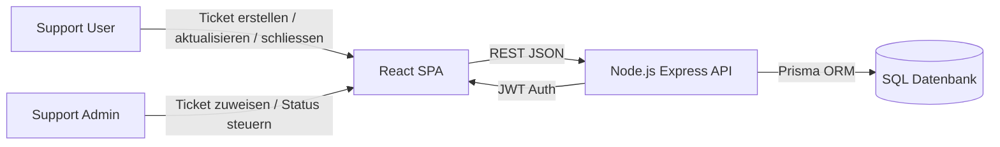
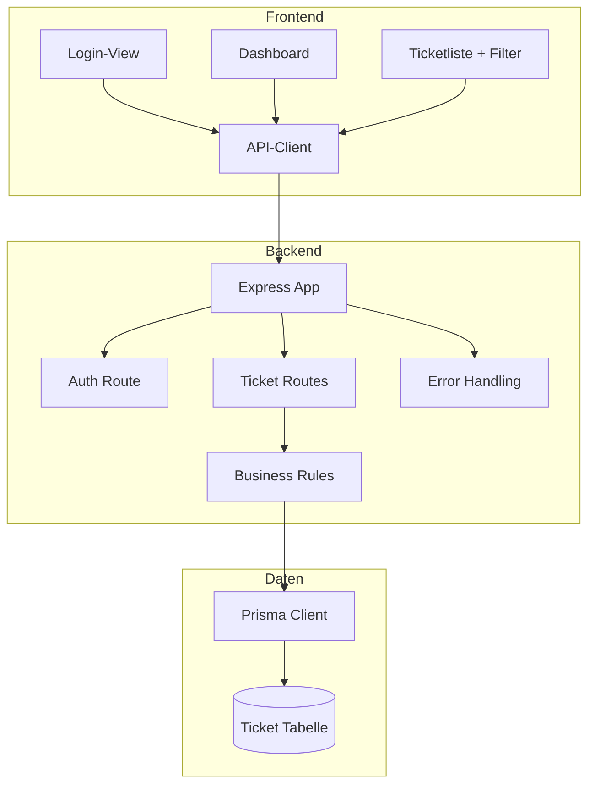
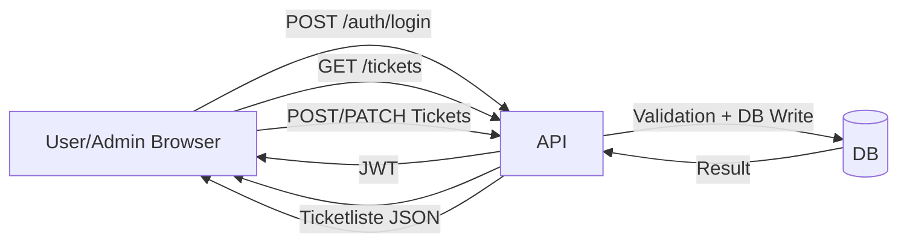

# Praxisarbeit WEVE.TA1A.PA - Webentwicklung Vertiefung

**Studiengang:** HFINFA, 3. Studienjahr  
**Modul:** Webentwicklung Grundlagen / Webentwicklung Vertiefung  
**Autor:** Jermain Huber  
**Version:** 1.0  
**Datum:** 08.02.2026

---

## 1. Management Summary

Ausgangslage dieser Praxisarbeit war die Aufgabe, fuer ein mittelstaendisches Unternehmen ein webbasiertes Ticketing-System fuer den Support zu entwickeln. Der Fokus lag auf einer modernen, wartbaren Webanwendung mit klarer Rollenlogik, zentraler Datenhaltung und einer nachvollziehbaren Continuous-Integration- und Continuous-Deployment-Kette.

Ich habe die Loesung als React Single Page Application (SPA) im Frontend und als Node.js/Express REST-API im Backend umgesetzt. Als Datenzugriffsschicht kommt Prisma zum Einsatz. Lokal wird mit SQLite entwickelt und getestet; die Architektur ist so aufgebaut, dass in der Produktion auch ein externer SQL-Dienst (z. B. Postgres) eingesetzt werden kann. Die Trennung von Frontend, API und Datenzugriff macht die Anwendung uebersichtlich und erleichtert Erweiterungen.

Die Kernanforderungen sind umgesetzt: Ein User kann Tickets erfassen, im Status `OPEN` anpassen und mit einer verpflichtenden Abschlussnotiz schliessen. Ein Admin kann Tickets zuweisen, uebernehmen und den Bearbeitungsstatus steuern. Gleichzeitig wurden fachliche Prozessregeln umgesetzt, damit der Ablauf in einer Support-Organisation sauber bleibt: Tickets werden durch User ausgeloest, inhaltliche Aenderungen sind auf den Ersteller und den offenen Zustand begrenzt, und jeder Abschluss muss mit einer Ursache-/Loesungsnotiz dokumentiert sein.

Fuer Stabilitaet und Sicherheit wurden JWT-Authentifizierung, Request-Validierung mit Zod, CORS-Regeln, Rate Limiting und sichere Header via Helmet integriert. Zur Qualitaetssicherung existieren automatisierte Tests (Backend Integrationstests, Frontend Unittest), die in GitHub Actions bei Pull Requests und Pushes laufen. Nach erfolgreichem CI-Lauf wird automatisch deployt: Frontend auf Netlify, Backend via Render Deploy Hook.

Damit erfuellt die Loesung die gestellten Anforderungen nicht nur funktional, sondern auch aus Betriebssicht: reproduzierbare Builds, nachvollziehbare Deployments und ein klarer Zugang fuer die Abnahme. Die Anwendung ist als MVP praxistauglich und kann in einem naechsten Schritt um SLA-Logik, Benachrichtigungen und Reporting erweitert werden.

---

## 2. Analyse und Design (Architektur)

### 2.1 Ausgangslage

Ein Support-Team bearbeitet taeglich wiederkehrende Kundenanfragen. Ohne strukturiertes Ticketing gehen Informationen verloren, Rueckfragen dauern zu lange, und Verantwortlichkeiten sind unklar. Ziel dieser Arbeit war deshalb, einen klaren, technischen und organisatorischen Prozess in einer Webanwendung abzubilden.

### 2.2 Zielbild

Das Zielbild fuer die Loesung war:

- klarer Ablauf von Ticket-Erstellung bis Abschluss
- eindeutige Rollentrennung zwischen User und Admin
- schnelle Bedienung im Browser ohne Seitenreloads
- stabile API mit validierten Eingaben
- automatisierte Tests und Deployments
- einfache Pruefbarkeit fuer Examinatoren

### 2.3 Projektabgrenzung

Nicht Bestandteil der Umsetzung waren:

- Mandantenfaehigkeit (mehrere Firmen in einem System)
- E-Mail-Benachrichtigungen
- Historisierung jeder Feld-Aenderung als Audit-Log
- Dateianhaenge an Tickets
- SLA-/Escalation-Engine

Diese Punkte sind fuer einen produktiven Ausbau relevant, aber fuer den Umfang der Praxisarbeit bewusst ausgegrenzt.

### 2.4 Stakeholder und Erwartungen

| Stakeholder | Erwartung | Relevanz fuer die Umsetzung |
|---|---|---|
| Support User | Ticket schnell erfassen und Status sehen | einfache Ticket-Erfassung, klare Uebersicht |
| Support Admin | Tickets uebernehmen, zuweisen, priorisieren | Admin-Steuerung im Ticket-Detail |
| Teamleitung | transparente Prozessqualitaet | Kennzahlen, Abschlussnotiz, Statuslogik |
| IT-Betrieb | stabiler und sicherer Betrieb | CI/CD, Healthcheck, CORS, Rate Limiting |
| Examinator | nachvollziehbare Facharbeit | Architekturbegruendung, Tests, Doku, Live-Links |

### 2.5 Funktionale Anforderungen

| ID | Anforderung | Muss/Soll | Umsetzungsstatus |
|---|---|---|---|
| F1 | User erstellt Support-Ticket | Muss | Erfuellt |
| F2 | User aktualisiert eigenes Ticket | Muss | Erfuellt (nur im Status `OPEN`) |
| F3 | User schliesst eigenes Ticket | Muss | Erfuellt (mit Pflicht-Notiz) |
| F4 | Admin weist Ticket zu | Muss | Erfuellt |
| F5 | Admin aendert Ticketstatus | Muss | Erfuellt |
| F6 | Zentrale Datenbank | Muss | Erfuellt |
| F7 | SPA im Frontend | Muss | Erfuellt |
| F8 | Node.js Backend | Muss | Erfuellt |
| F9 | Webservice-Kommunikation | Muss | Erfuellt (REST) |

### 2.6 Nicht-funktionale Anforderungen

| ID | Ziel | Messgroesse |
|---|---|---|
| N1 | Sicherheit | JWT-Auth aktiv, Validierung fuer alle schreibenden Endpunkte |
| N2 | Stabilitaet | API bietet `/health`, definierte Fehlerantworten |
| N3 | Wartbarkeit | TypeScript, klare Schichten, zentrale API-Contracts |
| N4 | Testbarkeit | automatisierte Tests in CI |
| N5 | Betrieb | automatisches Deployment nach erfolgreichem CI |
| N6 | Usability | responsive Layout, klare Rollenfuehrung, eindeutige Fehlertexte |

### 2.7 Loesungsvarianten

#### Variante A: React + Express + REST + SQL (ausgewaehlt)

- **Pro:** geringe Komplexitaet, sehr verbreiteter Stack, gute Lernzielabdeckung, starke Tooling-Unterstuetzung
- **Contra:** API-Vertraege muessen diszipliniert gepflegt werden

#### Variante B: Vue + Express + REST + MongoDB

- **Pro:** schneller Einstieg bei Frontend und Prototyping
- **Contra:** fuer klar relationale Ticketdaten weniger strikt als SQL

#### Variante C: Angular + GraphQL + SQL

- **Pro:** starke Struktur, flexible Queries
- **Contra:** hoeherer Initialaufwand fuer diese Aufgabenstellung

### 2.8 Entscheidmatrix

Bewertungsskala: 1 (schwach) bis 5 (sehr gut)

| Kriterium | Gewicht | A | B | C |
|---|---:|---:|---:|---:|
| Lernzielabdeckung WEVE | 25% | 5 | 4 | 4 |
| Implementierungsaufwand in 30h+ | 20% | 4 | 4 | 2 |
| Wartbarkeit | 20% | 4 | 3 | 5 |
| Testbarkeit | 15% | 5 | 4 | 4 |
| Deployment-Einfachheit | 10% | 5 | 5 | 3 |
| Team-/Marktstandard | 10% | 5 | 4 | 4 |
| **Gesamt** | **100%** | **4.6** | **3.9** | **3.7** |

**Begruendung:** Variante A liefert die beste Balance aus Aufwand, Qualitaet und Praxistauglichkeit. Deshalb wurde diese Variante umgesetzt.

### 2.9 Systemkontextdiagramm



### 2.10 Komponentenarchitektur (Big Picture)



### 2.11 Fachlicher Prozess (Soll-Prozess)

1. User erfasst Ticket (`OPEN`).
2. Admin uebernimmt oder weist Ticket zu (`assignedTo`).
3. Admin setzt Ticket auf `IN_PROGRESS`.
4. Abschluss erfolgt nur mit dokumentierter Ursache/Loesung (`resolutionNote`).
5. Ticketstatus wechselt auf `CLOSED` und `closedAt` wird gesetzt.

### 2.12 Datenfluss



### 2.13 Use Cases

#### UC-1: User erstellt und schliesst Ticket

- **Akteur:** User
- **Vorbedingung:** User ist eingeloggt
- **Hauptablauf:**
  1. User erfasst Titel, Beschreibung, Prioritaet.
  2. System speichert Ticket mit Status `OPEN`.
  3. User kann Ticket in `OPEN` bearbeiten.
  4. User schliesst Ticket mit Loesungsnotiz.
- **Nachbedingung:** Ticket ist `CLOSED`, Abschlussnotiz ist gespeichert.

#### UC-2: Admin uebernimmt Bearbeitung

- **Akteur:** Admin
- **Vorbedingung:** Ticket existiert
- **Hauptablauf:**
  1. Admin setzt Zuweisung (`assignedTo`).
  2. Admin setzt Status auf `IN_PROGRESS`.
  3. Admin schliesst Ticket mit Loesungsnotiz.
- **Nachbedingung:** Ticket ist sauber dokumentiert abgeschlossen.

#### UC-3: Unzulaessige Aktion wird geblockt

- **Akteur:** Admin oder User
- **Szenario:** Admin versucht Ticket zu erstellen oder User will Ticket ausserhalb `OPEN` bearbeiten.
- **Systemreaktion:** API liefert definierte Fehlerantwort (`403` oder `409`) mit klarer Meldung.

### 2.14 Risikoanalyse und Gegenmassnahmen

| Risiko | Eintritt | Auswirkung | Gegenmassnahme |
|---|---|---|---|
| Falsche Eingaben im Frontend | mittel | fehlerhafte Daten | Zod-Validierung im Backend |
| Missbrauch Login/API | mittel | Sicherheitsproblem | JWT, Rate Limiting, Helmet |
| CORS-Fehlkonfiguration | mittel | Frontend kann API nicht nutzen | definierte `CORS_ORIGIN`, Test mit Netlify + localhost |
| Deploy ohne Tests | niedrig | Regression in Produktion | CI als Pflicht-Gate |
| Render Cold Start | hoch (Free Plan) | langsamer erster Request | Hinweis in Doku, Healthcheck fuer Pruefung |

---

## 3. Implementation (inkl. Testing)

### 3.1 Technischer Ueberblick

Der Stack wurde bewusst schlank gehalten:

- Frontend: React + Vite + TypeScript
- Backend: Node.js + Express + TypeScript
- Datenzugriff: Prisma
- Lokale DB: SQLite
- Auth: JWT
- Validierung: Zod
- Tests: Vitest, Supertest, React Testing Library
- CI/CD: GitHub Actions, Netlify, Render

### 3.2 Projektstruktur

```text
/backend
  /prisma
    schema.prisma
  /src
    app.ts
    index.ts
    /db/prisma.ts
    /routes/auth.ts
    /routes/tickets.ts
/frontend
  /src
    App.tsx
    api.ts
    styles.css
/docs
  Report.md
  Report.pdf
/.github/workflows
  ci.yml
  deploy.yml
```

### 3.3 Backend-Implementierung

#### 3.3.1 Start und Konfiguration

- Environment wird zentral in `env.ts` geprueft.
- Beim Start wird das Schema sichergestellt (`ensureSchema`).
- Ein `/health`-Endpoint liefert den Betriebsstatus.

#### 3.3.2 Authentifizierung

- Login via `POST /auth/login` mit Demo-Accounts.
- Bei Erfolg liefert die API JWT + User-Rolle.
- Geschuetzte Endpunkte erwarten `Authorization: Bearer <token>`.

#### 3.3.3 Business Rules im Ticket-Flow

Die fachlichen Regeln sind serverseitig durchgesetzt:

- Admin darf kein Ticket direkt erstellen (`403`).
- Nur der Ersteller darf Ticketinhalt bearbeiten.
- Bearbeitung ist nur im Status `OPEN` erlaubt (`409` sonst).
- Abschluss verlangt `resolutionNote` (min. 10 Zeichen).
- Admin kann zuweisen und den Bearbeitungsstatus steuern.

### 3.4 Frontend-Implementierung

#### 3.4.1 Login und Rollenfuehrung

- Login-View mit klaren Demo-Zugaengen (`user/user123`, `admin/admin123`).
- Nach Login wird die Rolle im UI sofort sichtbar.
- UI blendet Ticket-Erfassung fuer Admin aus und zeigt stattdessen Admin-Hinweis.

#### 3.4.2 Ticket-Uebersicht

- Suche ueber Titel, Beschreibung, Ersteller und Zuweisung.
- Filter nach Status und Prioritaet.
- Sortierung nach letzter Aenderung, Erstellung oder Prioritaet.
- Kennzahlen (Total, Backlog, Closed Rate, In Arbeit) werden live berechnet.

#### 3.4.3 Ticket-Aktionen

- User sieht Bearbeiten nur, wenn eigenes Ticket und Status `OPEN`.
- Schliessen erfolgt ueber separates Formular mit Pflichtfeld fuer Loesung/Ursache.
- Admin hat Zusatzbereich fuer Uebernahme, Zuweisung und Statussteuerung.

### 3.5 Datenbank und Modell

#### 3.5.1 Modell

`Ticket` enthaelt die Felder:

- `id`
- `title`
- `description`
- `status` (`OPEN`, `IN_PROGRESS`, `CLOSED`)
- `priority` (`LOW`, `MEDIUM`, `HIGH`)
- `createdBy`
- `assignedTo` (optional)
- `resolutionNote` (optional, aber bei Abschluss Pflicht)
- `createdAt`, `updatedAt`, `closedAt`

#### 3.5.2 Persistenzstrategie

- Lokal: SQLite fuer schnelle Entwicklung.
- Produktion: gleicher Prisma-Layer, DB via `DATABASE_URL` austauschbar.
- Schema wird beim Start abgesichert, damit lokale Entwicklungsumgebungen robust bleiben.

### 3.6 API-Vertrag (kompakt)

| Methode | Endpoint | Zweck | Auth |
|---|---|---|---|
| POST | `/auth/login` | Token + Rolle holen | nein |
| GET | `/health` | Betriebsstatus pruefen | nein |
| GET | `/tickets` | Liste laden | ja |
| POST | `/tickets` | Ticket erfassen (nur User) | ja |
| PATCH | `/tickets/:id` | Ticketinhalt anpassen (Owner + OPEN) | ja |
| POST | `/tickets/:id/assign` | Ticket zuweisen (Admin) | ja |
| PATCH | `/tickets/:id/status` | Bearbeitungsstatus aendern (Admin) | ja |
| POST | `/tickets/:id/close` | Abschluss mit Notiz | ja |

### 3.7 Testkonzept

Die Teststrategie trennt Frontend und Backend:

- **Backend Integrationstests:** Endpunkte inklusive Auth und Rollenkontrolle
- **Frontend Unittest:** zentrale UI-Render- und Login-Pfade
- **CI-Lauf:** jeder PR und jeder Push auf `main`

#### 3.7.1 Gepruefte Backend-Szenarien

- `GET /health` liefert `200` und `status: ok`
- User kann Ticket erstellen und listen
- Admin kann nicht direkt Ticket erstellen
- Admin kann Ticket zuweisen und auf `IN_PROGRESS` setzen
- Owner darf nur in `OPEN` bearbeiten
- Abschluss ohne Notiz wird validierungsseitig blockiert

#### 3.7.2 Lokale Testbefehle

```bash
npm test
npm run build
```

Beide Befehle laufen im aktuellen Stand ohne Fehler.

### 3.8 CI/CD-Umsetzung

#### 3.8.1 CI (`ci.yml`)

- Checkout
- Node Setup
- `npm ci`
- `npm test`

#### 3.8.2 Deploy (`deploy.yml`)

- Trigger nach erfolgreichem CI auf `main`
- Frontend Build + Deploy zu Netlify
- Backend Deploy via Render Deploy Hook

Damit ist sichergestellt, dass nur gepruefter Code in die Live-Umgebung gelangt.

### 3.9 Deployment-Konfiguration

#### 3.9.1 GitHub Secrets

| Secret | Zweck |
|---|---|
| `NETLIFY_AUTH_TOKEN` | Auth fuer Netlify Deploy |
| `NETLIFY_SITE_ID` | Ziel-Site fuer Frontend |
| `VITE_API_URL` | API-Basis-URL fuer Frontend Build |
| `RENDER_DEPLOY_HOOK_URL` | Trigger fuer Backend Deploy |

#### 3.9.2 Render Environment Variables

| Variable | Wertbeispiel |
|---|---|
| `JWT_SECRET` | langer, zufaelliger Secret-String |
| `CORS_ORIGIN` | `https://weve-ticketing-system-jermain.netlify.app` |
| `DATABASE_URL` | SQL-Verbindungsstring |

### 3.10 Performance und UX

Massnahmen fuer gute Bedienbarkeit:

- Vite-Produktionsbuild fuer schnelle Auslieferung
- klare Status-/Prioritaetsbadges in der Uebersicht
- Eingabevalidierung clientseitig und serverseitig
- kurze, klare Fehlermeldungen mit Ursache
- responsive Layout fuer Desktop und Mobile

### 3.11 Security-Massnahmen

- JWT-gesicherte Endpunkte
- Eingabekontrolle mit Zod
- `helmet()` fuer sichere HTTP-Header
- Rate Limiting gegen brute-force und abuse
- CORS mit erlaubten Origins

### 3.12 Betrieb und Abnahmefreundlichkeit

Die Loesung ist so vorbereitet, dass ein Examinator ohne lokale Installation pruefen kann.

**Direkter Zugang:**

- Frontend: `https://weve-ticketing-system-jermain.netlify.app`
- Backend Health: `https://weve-ticketing-api-jermain.onrender.com/health`
- Repo: `https://github.com/JermainIPSO/ticketing-system-weve`

**Wichtig fuer die Pruefung:**

- Render Free kann nach Inaktivitaet schlafen.
- Erster API-Request kann dadurch bis ca. 50 Sekunden brauchen.
- Backend Root (`/`) zeigt bewusst `{"message":"Not Found"}`; relevante Endpunkte sind `/health`, `/auth/login`, `/tickets`.

### 3.13 Traceability (Anforderung -> Nachweis)

| Anforderung | Technischer Nachweis |
|---|---|
| User erstellt Ticket | `POST /tickets` (User erlaubt) |
| User aktualisiert Ticket | `PATCH /tickets/:id` (Owner + OPEN) |
| User schliesst Ticket | `POST /tickets/:id/close` mit `resolutionNote` |
| Admin weist zu | `POST /tickets/:id/assign` |
| Admin aendert Status | `PATCH /tickets/:id/status` |
| Zentrale Datenbank | Prisma + SQL-Datenmodell |
| SPA | React + Vite |
| Node Backend | Express + TypeScript |
| Webservices | REST JSON |
| CI/CD | GitHub Actions + Netlify + Render |

### 3.14 Fachliche Bewertung der Loesung

Die Rollenlogik wurde bewusst strikt gebaut. In vielen einfachen Ticket-Tools kann jeder fast alles bearbeiten. Fuer einen pruefungsrelevanten und auditierbaren Prozess ist das nicht ideal. Mit der aktuellen Logik bleibt nachvollziehbar:

- wer ein Ticket ausgeloest hat
- ab wann Bearbeitung laeuft
- wer abgeschlossen hat
- welche Ursache bzw. Loesung dokumentiert wurde

Damit ist das Ergebnis nicht nur funktional, sondern auch fachlich begruendbar.

### 3.15 Betriebs-Runbook (fuer Demo und produktionsnahen Betrieb)

Damit die Anwendung im Live-Test reproduzierbar pruefbar ist, wurde ein kleines Runbook definiert. Dieses Kapitel ist bewusst operativ formuliert, weil in der Praxis nicht nur der Code zaehlt, sondern auch ein stabiler Ablauf beim Betrieb.

#### 3.15.1 Pre-Deploy-Checkliste

Vor jedem Merge auf `main`:

1. alle lokalen Tests laufen (`npm test`)
2. Build ist lokal erfolgreich (`npm run build`)
3. keine offenen Merge-Konflikte
4. geaenderte Business Rules sind in der Doku nachgezogen
5. bei API-Aenderung: Frontend-Client geprueft

#### 3.15.2 Deploy-Ablauf in Kurzform

1. Push auf `main`
2. GitHub Action `CI` startet und testet Frontend + Backend
3. bei Erfolg startet Action `Deploy`
4. Netlify bekommt neues Frontend-Build
5. Render wird ueber Deploy Hook neu gestartet
6. Healthcheck pruefen (`/health`)

#### 3.15.3 Post-Deploy-Smoke-Test

Direkt nach dem Deployment wird ein kurzer Funktionstest ausgefuehrt:

- Frontend-URL laden
- Login als `user` und `admin` pruefen
- ein Ticket erstellen
- Ticket als Admin uebernehmen
- Ticket mit Notiz abschliessen
- Ticketliste auf Konsistenz pruefen

Dieser Ablauf dauert in der Regel unter 3 Minuten und reduziert das Risiko, unbemerkt einen Regression-Fehler in Produktion zu haben.

#### 3.15.4 Rollback-Strategie

Im aktuellen Setup (Netlify + Render + GitHub) kann ein Rollback pragmatisch erfolgen:

- Frontend: in Netlify auf vorherigen erfolgreichen Deploy zuruecksetzen
- Backend: letzten stabilen Commit in `main` wiederherstellen und deployen
- Datenbank: bei kritischen Aenderungen vorab Backup-Strategie definieren

Fuer diese Praxisarbeit wurde bewusst auf komplexe Migrationen verzichtet. Deshalb ist das Risiko fuer irreversible Datenfehler tief.

### 3.16 Troubleshooting-Leitfaden

| Symptom | Wahrscheinliche Ursache | Massnahme |
|---|---|---|
| Frontend zeigt `NetworkError` | API nicht erreichbar oder falsche `VITE_API_URL` | Netlify-Env pruefen, API-Health pruefen |
| CORS-Fehler im Browser | `CORS_ORIGIN` nicht korrekt gesetzt | Render-Variable auf Netlify-Domain setzen |
| Login funktioniert lokal, aber nicht live | falscher API-Endpoint im Build | neues Frontend-Build mit korrekter `VITE_API_URL` deployen |
| API antwortet langsam beim ersten Aufruf | Render Free Cold Start | 30-50 Sekunden warten, danach erneut testen |
| `Validation failed` beim Schliessen | `resolutionNote` fehlt oder zu kurz | mindestens 10 Zeichen als Loesung erfassen |
| Admin kann kein Ticket erstellen | fachliche Regel aktiv | gewolltes Verhalten, Ticket muss durch User ausgeloest werden |
| Ticket laesst sich nicht mehr bearbeiten | Ticket ist nicht mehr `OPEN` | ebenfalls gewolltes Verhalten laut Prozess |

#### 3.16.1 Typische Fehlerbilder aus der Umsetzung

Waehren der Implementierung sind vor allem drei Fehlerarten aufgetreten:

1. **CORS-Diskrepanzen zwischen localhost und Netlify**
   - geloest durch klaren Origin-Check im Backend und konsistente Umgebungsvariablen.
2. **Fehlende Prisma-Initialisierung in CI**
   - geloest durch expliziten `prisma generate` Schritt im Testscript.
3. **Klick-Blockierung durch visuelle Overlay-Effekte**
   - geloest durch CSS-Anpassung (`pointer-events`) und anschliessenden UI-Retest.

Diese Punkte wurden bewusst dokumentiert, weil sie in realen Projekten sehr haeufig sind und viel Zeit kosten koennen, wenn sie nicht strukturiert analysiert werden.

### 3.17 Qualitaetsnachweis entlang der Bewertungslogik

Das Projekt wurde nicht nur auf Funktionsfaehigkeit geprueft, sondern explizit entlang der erwarteten Bewertungskriterien ausgerichtet:

- **Formale Aspekte:** klare Struktur, einheitliche Sprache, Quellen und reproduzierbare Schritte
- **Themenbezogene Guete:** Architekturvarianten, Risikoanalyse, begruendete Technologieentscheidung
- **Nachvollziehbarkeit:** roter Faden von Anforderung bis Testfall
- **Praxistauglichkeit:** live erreichbar, rollenbasiert, CI/CD aktiv, schneller Abnahmezugang

Diese Zuordnung ist fuer die Abschlussbewertung zentral, weil sie zeigt, dass nicht nur entwickelt, sondern auch reflektiert und begruendet wurde.

---

## 4. Lessons Learned

### 4.1 Technische Erkenntnisse

1. **Business Rules gehoeren ins Backend.**
   Nur UI-Regeln reichen nicht. Entscheidend ist, dass die API unzulaessige Aktionen blockiert.

2. **Validierung spart Debugging-Zeit.**
   Mit Zod werden Eingabefehler frueh und strukturiert erkannt.

3. **CI frueh einrichten lohnt sich.**
   Ein gruener CI-Lauf vor Deploy verhindert viele unnötige Fehler in der Live-Umgebung.

4. **CORS ist ein typischer Stolperstein.**
   Lokale URL, Netlify-URL und Produktions-API muessen konsistent konfiguriert sein.

### 4.2 Methodische Erkenntnisse

1. **Architekturvarianten zuerst vergleichen.**
   Das macht spaetere Entscheidungen nachvollziehbar und sauber begruendbar.

2. **Fruehe Abnahmesicht hilft.**
   Wer schon waehrend der Entwicklung an den Live-Test denkt, baut automatisch klarer.

3. **Dokumentation ist Teil der Loesung, nicht Anhang.**
   Eine gute technische Umsetzung ohne nachvollziehbare Dokumentation verliert in der Bewertung.

### 4.3 Naechste sinnvolle Ausbauschritte

- Dateianhaenge am Ticket
- E-Mail-Benachrichtigungen bei Statuswechsel
- SLA-Felder und automatische Eskalationsregeln
- Dashboard mit Zeitreihen (Durchlaufzeit, Backlog-Entwicklung)
- Rollenmodell mit mehreren Admin-Gruppen

### 4.4 Persoenliche Reflexion zur Umsetzung

Rueckblickend war der wichtigste Lernerfolg, Business Rules und technische Umsetzung nicht getrennt zu betrachten. Die entscheidenden Qualitaetspunkte lagen nicht bei der Anzahl Features, sondern bei der Frage, ob der Prozess im Code konsistent erzwungen wird. Genau dort lag der groesste Mehrwert:

- Admin kann nicht an der User-Erfassung vorbei arbeiten.
- Abschluss ist ohne dokumentierte Ursache nicht moeglich.
- Status und Inhalt folgen einem klaren, pruefbaren Ablauf.

Aus fachlicher Sicht fuehrt das zu besserer Nachvollziehbarkeit im Support. Aus technischer Sicht macht es das System robuster gegen zufaellige oder unklare Bedienung.

Ein zweiter wichtiger Punkt war die Bedeutung einer sauberen End-to-End-Sicht: Erst wenn lokale Tests, CI, Deployment und Live-Smoke-Test zusammenpassen, ist eine Loesung wirklich abnahmefaehig.

---

## 5. Anhang

### 5.1 Projektstruktur (Kurzform)

```text
/backend   API + Datenzugriff
/frontend  SPA
/docs      Report + PDF
```

### 5.2 Experten-Schnelltest (Live)

1. Frontend oeffnen: `https://weve-ticketing-system-jermain.netlify.app`
2. Login als User: `user / user123`
3. Ticket erfassen, danach bearbeiten und mit Notiz schliessen
4. Login als Admin: `admin / admin123`
5. Ticket uebernehmen, zuweisen und Status pruefen
6. Backend Health pruefen: `https://weve-ticketing-api-jermain.onrender.com/health`

### 5.3 Testprotokoll fuer die Abnahme

| Schritt | Erwartung |
|---|---|
| Login User | Token wird erstellt, Dashboard sichtbar |
| Ticket erstellen | neues Ticket mit Status `OPEN` sichtbar |
| Ticket bearbeiten (OPEN) | Speichern erfolgreich |
| Ticket bearbeiten (nach `IN_PROGRESS`) | API blockiert mit klarer Meldung |
| Abschluss ohne Notiz | Validierung blockiert |
| Abschluss mit Notiz | Ticket wird `CLOSED`, Notiz sichtbar |
| Admin erstellt Ticket direkt | blockiert (`403`) |

### 5.4 Quellen

- OWASP Top 10: https://owasp.org/www-project-top-ten/
- React Dokumentation: https://react.dev
- Express Dokumentation: https://expressjs.com
- Prisma Dokumentation: https://www.prisma.io/docs
- Node.js Dokumentation: https://nodejs.org/docs/latest/api/
- Vitest Dokumentation: https://vitest.dev
- Render Dokumentation: https://render.com/docs
- Netlify Dokumentation: https://docs.netlify.com

### 5.5 Projektreferenzen

- GitHub: `https://github.com/JermainIPSO/ticketing-system-weve`
- Frontend: `https://weve-ticketing-system-jermain.netlify.app`
- Backend: `https://weve-ticketing-api-jermain.onrender.com`

### 5.6 Abgabe-Checkliste

- [x] Management Summary vorhanden
- [x] Analyse und Design dokumentiert
- [x] Implementation inkl. Testing dokumentiert
- [x] Lessons Learned ausgefuehrt
- [x] Anhang mit Quellen und Links vorhanden
- [x] Live-Links fuer Pruefung vorhanden
- [x] PDF erzeugt
- [x] Source-Code fuer ZIP bereit

### 5.7 Selbstcheck gegen Bewertungskriterien

| Kriterium | Selbstbewertung |
|---|---|
| Formale Aspekte | Alle geforderten Kapitel, saubere Gliederung, Quellen und klare Sprache vorhanden |
| Guete der thematischen Auseinandersetzung | Architekturvarianten, Risikoanalyse, fachliche Begruendung und technische Umsetzung dokumentiert |
| Nachvollziehbare Vorgehensweise | roter Faden von Anforderungen ueber Design bis Test und Deploy durchgehend sichtbar |
| Praxistaugliches Ergebnis | live lauffaehiges System mit rollenbasiertem Prozess, automatisierten Tests und Deployment |

### 5.8 Architekturentscheidungen (ADR-Auszug)

#### ADR-01: REST statt GraphQL

- **Status:** akzeptiert
- **Kontext:** fuer die Aufgabenstellung war ein klarer, stabiler CRUD-Flow wichtiger als flexible Query-Komposition.
- **Entscheid:** REST-Endpunkte mit klaren Rollenrechten.
- **Folge:** geringerer Komplexitaetsgrad, schneller testbar.

#### ADR-02: Prisma als ORM

- **Status:** akzeptiert
- **Kontext:** TypeScript-Stack, Fokus auf schnelle Entwicklung und sichere Datenzugriffe.
- **Entscheid:** Prisma als zentrale DB-Abstraktion.
- **Folge:** klare Modelle, reproduzierbarer Zugriff, einfacher Wechsel der Datenbank ueber `DATABASE_URL`.

#### ADR-03: Strikte Rollenlogik im Backend

- **Status:** akzeptiert
- **Kontext:** Frontend-Regeln allein reichen nicht, weil API sonst umgangen werden kann.
- **Entscheid:** alle zentralen Regeln serverseitig absichern.
- **Folge:** hohe Prozesskonsistenz und bessere Auditierbarkeit.

#### ADR-04: Pflichtfeld fuer Abschlussnotiz

- **Status:** akzeptiert
- **Kontext:** ohne Abschlussnotiz ist ein Ticket fachlich oft nicht auswertbar.
- **Entscheid:** Abschluss nur mit `resolutionNote` (mind. 10 Zeichen).
- **Folge:** bessere Dokumentationsqualitaet fuer Betrieb und Analyse.
