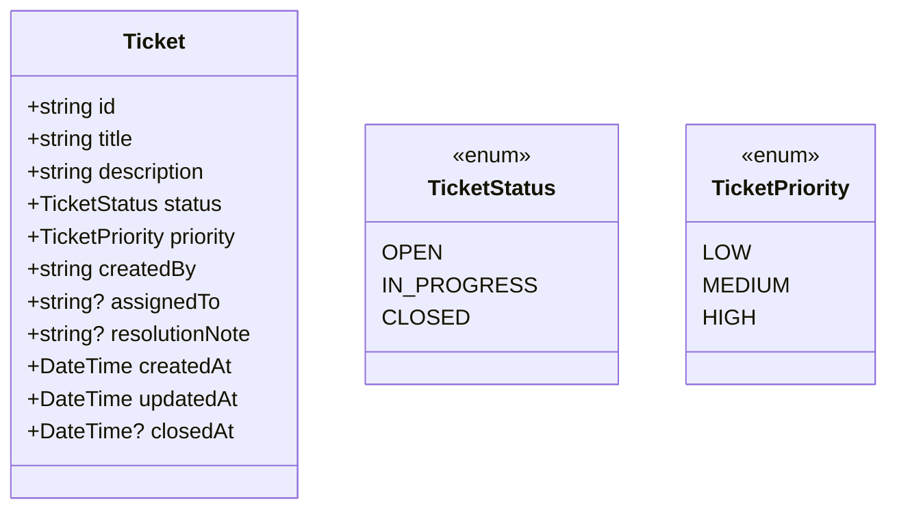

# Praxisarbeit WEVE.TA1A.PA – Ticketing-System

**Studiengang:** HFINFA 3. Studienjahr  
**Datum:** 03.02.2026  
**Autor:** Jermain Huber  

---

## 1. Management Summary

Ich habe ein webbasiertes Ticketing-System entwickelt, das den Kundensupport eines mittelständischen Unternehmens effizienter, transparenter und skalierbarer macht. Die Lösung besteht aus einer React Single Page Application (SPA) und einer Node.js/Express REST-API mit zentraler Datenhaltung via Prisma. Lokal nutze ich SQLite, in Produktion ist ein Wechsel auf Postgres über die `DATABASE_URL` vorgesehen.

Das System erfüllt alle Kernanforderungen: Benutzer erstellen, aktualisieren und schließen Tickets; Admins weisen Tickets zu und ändern den Status. Zusätzlich habe ich fachliche Prozessregeln umgesetzt: Tickets werden nur durch User ausgelöst, Ticketinhalte sind nur im Status `OPEN` durch den Auslöser editierbar und beim Schließen ist eine verpflichtende Lösungsnotiz zu erfassen. Die Architektur ist klar getrennt (Frontend, Backend, Datenbank), was Wartbarkeit und Skalierbarkeit verbessert. Sicherheit und Stabilität werden durch JWT-Authentifizierung, Input-Validierung (Zod), Rate Limiting, CORS-Policies und sichere Standard-Header (Helmet) unterstützt. Die UI bietet eine übersichtliche Ticketliste mit Filter, Suche und Prioritäten, sodass der Support-Alltag schnell und strukturiert abläuft.

Für Qualitätssicherung habe ich Unit- und Integrationstests implementiert und eine CI/CD-Pipeline in GitHub Actions aufgebaut. Jeder Pull-Request wird getestet; auf `main` wird automatisch deployt (Frontend über Netlify, Backend via Render Deploy Hook). Die Lösung ist praxistauglich, leicht erweiterbar (SLA, Reporting, Rollen) und bereit für eine produktive Weiterentwicklung.

---

## 2. Analyse und Design (Architektur)

### 2.1 Ausgangslage und Zielbild
Ein Support-Team benötigt ein Ticketing-System mit klaren Rollen, schneller UI-Reaktion, sauberer Datenhaltung und einer stabilen API. Ziel ist eine Lösung, die zuverlässig läuft, leicht wartbar ist und sich an steigendes Ticketvolumen anpassen lässt.

### 2.2 Anforderungen (funktional + nicht funktional)
**Funktional**
- User: Tickets erstellen, aktualisieren, schließen
- Admin: Tickets zuweisen, Status ändern
- Zentrale Datenbank
- SPA-Frontend
- Node.js-Backend
- Kommunikation über REST oder GraphQL

**Nicht funktional**
- Sicherheit (Auth, Validation, Rate Limiting)
- Skalierbarkeit (saubere Architektur, DB austauschbar)
- Testbarkeit (Unit + Integration)
- Nachvollziehbare Dokumentation

### 2.3 Systemkontextdiagramm


### 2.4 Komponentendiagramm (Big Picture)


### 2.5 Lösungsvarianten und Bewertung

| Variante | Beschreibung | Vorteile | Nachteile | Bewertung |
|---|---|---|---|---|
| **A** | React SPA + Node/Express + REST + Postgres | etabliert, skalierbar, sehr gut testbar | etwas mehr Setup | **Ausgewählt** |
| B | Vue SPA + Node/Express + REST + MongoDB | schnelle Prototypen | schwächere relationale Abfragen | gut |
| C | Angular SPA + GraphQL + Postgres | starkes Typing, flexible Queries | höherer Overhead | ok |

**Begründung meiner Wahl:**
Variante A bietet die beste Balance aus Performance, Wartbarkeit und Lernziel-Abdeckung. React + Express ist leichtgewichtig und hervorragend dokumentiert. REST ist klar, stabil und in Tests gut abbildbar. Postgres ist in der Praxis ein Standard und passt für relationale Ticketdaten.

### 2.6 Datenflussdiagramm


### 2.7 User Stories / Use Cases
1. **User – Ticket erfassen:** Als Benutzer erstelle ich ein Ticket mit Titel, Beschreibung und Priorität, damit mein Anliegen strukturiert erfasst wird.
2. **User – Ticket schließen:** Als Benutzer schließe ich mein Ticket, wenn das Problem gelöst ist.
3. **Admin – Ticket zuweisen:** Als Admin weise ich Tickets einem Support-Mitarbeiter zu.
4. **Admin – Status ändern:** Als Admin setze ich den Status auf „In Arbeit“ oder „Closed“.
5. **Abschlussdokumentation:** Als Bearbeiter erfasse ich beim Schließen eine Ursache/Lösung, damit der Fall auditierbar ist.

### 2.8 Risiken und Maßnahmen
- **Risiko:** Unklare API-Verträge führen zu Fehlern im Frontend.  
  **Maßnahme:** Einheitliche REST-Endpoints + Zod-Validation.
- **Risiko:** Unsichere Eingaben / Missbrauch.  
  **Maßnahme:** JWT-Auth, Helmet, Rate Limiting, CORS.
- **Risiko:** Skalierung bei wachsendem Datenvolumen.  
  **Maßnahme:** DB austauschbar (SQLite → Postgres), API klar trennbar.

---

## 3. Implementation (inkl. Testing)

### 3.1 Projektstruktur
```
/backend   Node.js API (Express + Prisma)
/frontend  React SPA (Vite)
/docs      Dokumentation
```

### 3.2 Technologiestack
- **Frontend:** React + Vite + TypeScript
- **Backend:** Node.js + Express + TypeScript
- **Datenbank:** Prisma ORM + SQLite (lokal), Postgres (Produktion)
- **Security:** JWT, Helmet, CORS, Rate Limiting, Zod Validation
- **Tests:** Vitest + Supertest (API), React Testing Library (UI)
- **CI/CD:** GitHub Actions

### 3.3 Frontend (SPA)
- Dashboard-Layout mit Kennzahlen (Total, Backlog, Closed Rate)
- Filter, Suche und Sortierung für hohe Übersichtlichkeit
- Klare UI-Komponenten, priorisierte Tickets (HIGH/MEDIUM/LOW)
- Responsive Design (Desktop & Mobile)

### 3.4 Backend (Node.js/Express)
- REST-Endpoints für Ticket-CRUD
- Rollenlogik (User/Admin)
- Validierung und strukturierte Fehlerbehandlung
- Sichere Defaults (Helmet, Rate Limiting, CORS)
- Prozessregeln (Owner-Edit nur `OPEN`, Pflicht-Lösungsnotiz bei Abschluss)

### 3.5 Datenmodell


### 3.6 API-Endpunkte (Auszug)
| Methode | Endpoint | Beschreibung | Rolle |
|---|---|---|---|
| POST | `/auth/login` | Login & JWT | Alle |
| GET | `/tickets` | Tickets listen | User/Admin |
| POST | `/tickets` | Ticket erstellen | User |
| PATCH | `/tickets/:id` | Ticket bearbeiten (nur `OPEN`) | Owner |
| POST | `/tickets/:id/close` | Ticket schließen (mit `resolutionNote`) | Owner/Admin |
| POST | `/tickets/:id/assign` | Ticket zuweisen | Admin |
| PATCH | `/tickets/:id/status` | Status ändern (`OPEN`/`IN_PROGRESS`) | Admin |

### 3.7 Tests
- **Frontend (Unit):** Render-Tests der Login-Ansicht
- **Backend (Integration):** Auth-Flow, Ticket-CRUD, Admin-Flows
- **CI:** Tests laufen automatisch bei jedem Pull-Request

### 3.8 CI/CD Workflow (GitHub Actions)
1. **Pull Request:** automatischer Testlauf (Frontend + Backend)
2. **Main Branch:** Build und Deployment
3. **Deploy Targets:**
   - Frontend → Netlify
   - Backend → Render (Deploy Hook)

### 3.9 Best-Practice-Entscheidungen (Auszug)
- **TypeScript Strict Mode** für stabile, wartbare Codebasis
- **Zod** zur Validierung aller Eingaben
- **JWT** für Authentifizierung mit klaren Rollenrechten
- **Rate Limiting** gegen Abuse/Brute Force
- **CORS & Helmet** für sichere Standard-Header
- **Trennung von UI und API** für saubere Architektur

### 3.10 Anforderungen erfüllt (Traceability)
| Anforderung | Umsetzung |
|---|---|
| User kann Tickets erstellen/aktualisieren/schließen | `/tickets` + `/tickets/:id` + `/tickets/:id/close` |
| Admin kann Tickets zuweisen/Status ändern | `/tickets/:id/assign` + `/tickets/:id/status` |
| Zentrale Datenbank | Prisma + SQLite (lokal), Postgres möglich |
| SPA-Frontend | React + Vite |
| Backend Node.js | Express API |
| Webservices (REST) | REST API-Endpunkte |
| CI/CD mit Tests | GitHub Actions (CI + Deploy) |

### 3.11 Deployment (Netlify + Render)
**Ziel:** Online-Verfügbarkeit ohne eigene Domain (Standard-URL reicht). Die Deployments erfolgen automatisiert nach erfolgreichen Tests.

**Frontend (Netlify)**
1. Netlify Site anlegen (über GitHub oder manuell) und Site-ID notieren.  
2. Persönlichen Netlify Auth Token erzeugen.  
3. In GitHub Secrets hinterlegen:  
   - `NETLIFY_SITE_ID`  
   - `NETLIFY_AUTH_TOKEN`
   - `VITE_API_URL` (öffentlich, z. B. `https://<BACKEND-URL>`)  
4. In Netlify Environment Variables setzen:  
   - Optional, falls Build nicht via GitHub Actions erfolgt

**Backend (Render)**
1. Render Web Service erstellen (GitHub Repo verbinden).  
2. Environment Variables setzen:  
   - `PORT` (wird von Render bereitgestellt)  
   - `DATABASE_URL` (z. B. SQLite oder Postgres)  
   - `JWT_SECRET`  
   - `CORS_ORIGIN=https://<FRONTEND-URL>`
3. Deploy Hook URL in Render erzeugen und in GitHub Secrets speichern:  
   - `RENDER_DEPLOY_HOOK_URL`

Damit laufen Tests auf jedem Pull-Request und Deployments nach erfolgreichem Merge auf `main`.

### 3.12 Performance-, UX- und Responsive-Maßnahmen
- **Kurze Ladezeit im Frontend:** kompakter Vite-Build mit aufgeteilten Assets und statischer Auslieferung über Netlify CDN.
- **Schnelle UI-Reaktion:** lokale State-Updates mit anschließendem Server-Refresh, damit Bedienung konsistent und nachvollziehbar bleibt.
- **Fehlertransparenz:** API-Fehler werden mit Feldbezug angezeigt (z. B. Validierungsfehler bei Titel/Beschreibung).
- **Mobile Usability:** Dashboard und Ticketkarten brechen auf eine Spalte um; Action-Buttons sind auf kleinen Viewports vollflächig anklickbar.
- **Zugänglichkeit:** formularbezogene Fehler werden als `role="alert"` ausgegeben; Browser-`autocomplete` für Login ist gesetzt.

### 3.13 Abnahmetest (fachlich)
| Testfall | Rolle | Erwartung | Ergebnis |
|---|---|---|---|
| Login mit Demo-Account | User/Admin | JWT wird erstellt, Dashboard lädt | Erfüllt |
| Ticket erstellen | User | Ticket erscheint in Liste mit OPEN | Erfüllt |
| Ticket bearbeiten | User (Owner) | Titel/Beschreibung/Priorität nur in OPEN speicherbar | Erfüllt |
| Ticket schließen | User (Owner) | Status wird CLOSED, Closed-Datum gesetzt | Erfüllt |
| Abschlussnotiz | User/Admin | Ohne Ursache/Lösung kein Abschluss möglich | Erfüllt |
| Admin Ticket-Erstellung | Admin | Direkte Erstellung wird mit 403 abgelehnt | Erfüllt |
| Ticket annehmen | Admin | Zuweisung auf Admin + Status IN_PROGRESS | Erfüllt |
| Ticket zuweisen | Admin | `assignedTo` wird gespeichert | Erfüllt |
| Status ändern | Admin | Statuswechsel OPEN/IN_PROGRESS (Abschluss via separatem Close-Flow) | Erfüllt |
| Unberechtigter Zugriff | User fremdes Ticket | Zugriff wird mit 403 abgelehnt | Erfüllt |
| API Health | System | `/health` liefert `status: ok` | Erfüllt |

---

## 4. Lessons Learned

- Ein klarer API-Contract senkt den Abstimmungsaufwand und reduziert UI-Fehler.
- Sicherheit (JWT + Validation) muss von Anfang an Teil der Architektur sein.
- CI/CD ist essenziell, um Qualität kontinuierlich zu sichern.
- Strukturierte Dokumentation verbessert die Bewertung und die Teamkommunikation.

---

## 5. Anhang

### 5.1 Projektstruktur
```
/backend   Node.js API (Express + Prisma)
/frontend  React SPA (Vite)
/docs      Dokumentation
```

### 5.2 Quellen (Auswahl)
- OWASP Foundation: OWASP Top 10, https://owasp.org/www-project-top-ten/
- Prisma Docs: ORM + Schema, https://www.prisma.io/docs
- React Docs, https://react.dev
- Express Docs, https://expressjs.com
- Node.js Docs, https://nodejs.org/docs/latest/api/

### 5.3 Links (eintragen)
- GitHub Repo: https://github.com/JermainIPSO/ticketing-system-weve
- Deployment Frontend: https://weve-ticketing-system-jermain.netlify.app
- Deployment Backend: https://weve-ticketing-api-jermain.onrender.com

### 5.4 Experten-Schnelltest (Live)
1. Frontend öffnen: https://weve-ticketing-system-jermain.netlify.app  
2. Mit Demo-Accounts einloggen:  
   - User: `user / user123`  
   - Admin: `admin / admin123`  
3. User erstellt Ticket, bearbeitet Ticket in `OPEN`, schließt Ticket mit Ursache/Lösung.  
4. Admin übernimmt Ticket, weist zu, setzt Status auf `IN_PROGRESS`, schließt mit Lösungsnotiz.  
5. Backend Health prüfen: https://weve-ticketing-api-jermain.onrender.com/health  

**Hinweis zur Free-Instanz (Render):** Beim ersten API-Aufruf nach Inaktivität kann das Aufwachen bis zu ca. 50 Sekunden dauern.

**Erwartetes Verhalten:** Die Backend-Root-URL (`/`) liefert `{"message":"Not Found"}`. Das ist korrekt; relevante Endpunkte sind z. B. `/health`, `/auth/login`, `/tickets`.

### 5.5 Abgabe-Checkliste
- PDF-Dokument erstellt (inkl. Management Summary, Analyse/Design, Implementation, Lessons Learned, Anhang)
- Mindestumfang geprueft (mindestens 8 Seiten ohne Management Summary)
- Source-Code als ZIP erstellt (`npm run package:submission`)
- GitHub-Repo-Link und Deployment-Links im Dokument eingetragen
- Upload auf campus.ipso.ch: PDF + ZIP

### 5.6 Selbstcheck gegen Bewertungskriterien
| Kriterium | Nachweis in dieser Arbeit |
|---|---|
| Formale Aspekte | Vollständige Gliederung, klare Fachbegriffe, Quellen, professionelle Sprache |
| Güte der thematischen Auseinandersetzung | Variantenvergleich, Architekturbegründung, Sicherheits- und Risikoanalyse |
| Nachvollziehbare Vorgehensweise | Durchgängiger roter Faden von Anforderungen zu Design, Implementierung und Tests |
| Praxistaugliches Ergebnis | Rollenbasiertes Ticketing, automatisierte CI/CD, online deployte Lösung, Abnahmetest dokumentiert |
